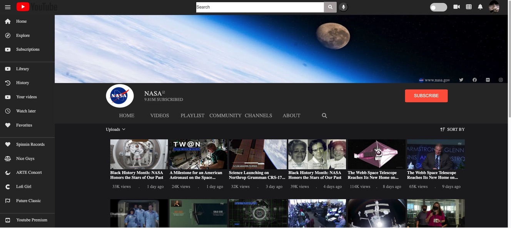

## Youtube Clone of the NASA account

**[Test this app yourself](https://maykaltenev.github.io/youtube-clone/)**

---

### About Project

This project is part of the Digital Career Institute curriculum. It is mend to implement the basic and advance HTML & CSS approaches that we covered during the first month of the journey. The layout is made with grid and the inside arrangements are made with flexbox. I implemented a little mouseover effect with JavaScript.

### How to use this Project

The project is solely for learning purpose and its made to practice and polish my design skills, while learning from one of the best on the market - YouTube.

##### Developed With

- [x] _HTML5_
- [ ] _CSS3_
- [x] _SASS_
- [x] _SCSS_
- [x] _JavaScript_
- [ ] _React_
- [ ] _Bootstrap_

---

### Contact

Mail: <michaeltenev@mail.com> 
GitHub: [michaeltenev](https://github.com/maykaltenev) 
LinkedIn: [Maykal Tenev](https://www.linkedin.com/in/maykal-tenev-a8729586/)

---

### Used Tools

- [npm](https://www.npmjs.com/)
- [Google Fonts](https://fonts.google.com/)
- [Visual Studio Code](https://code.visualstudio.com/)
- [Adobe Color](https://color.adobe.com/create/color-wheel)

---

Made with ❤️ by me
